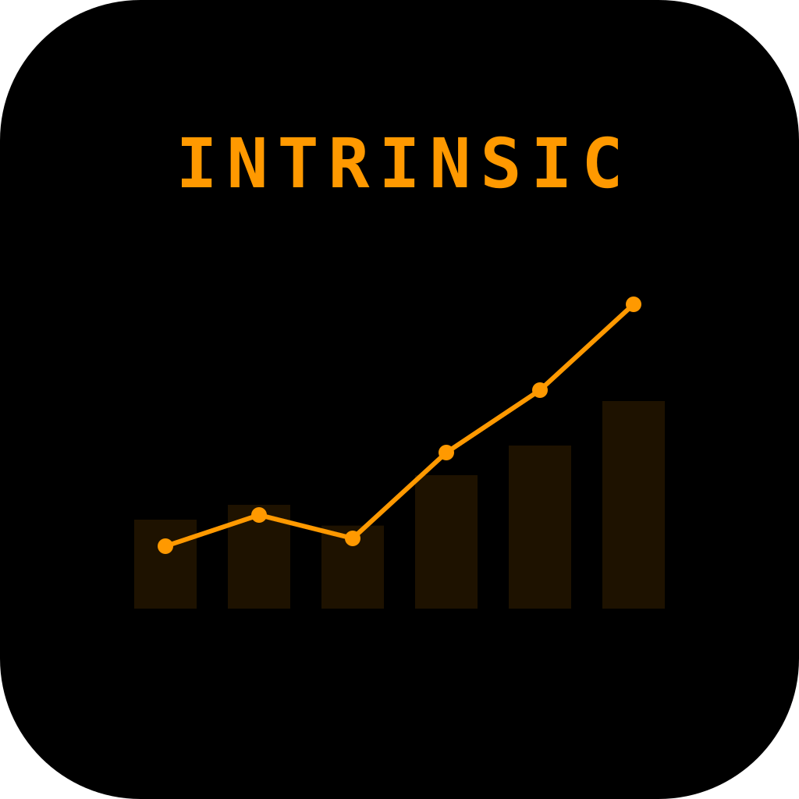
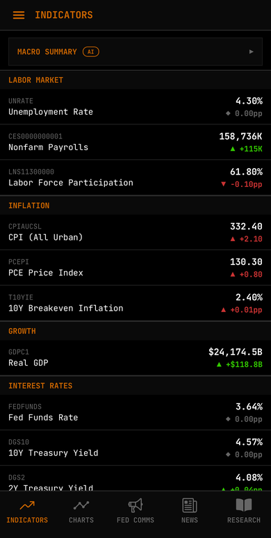
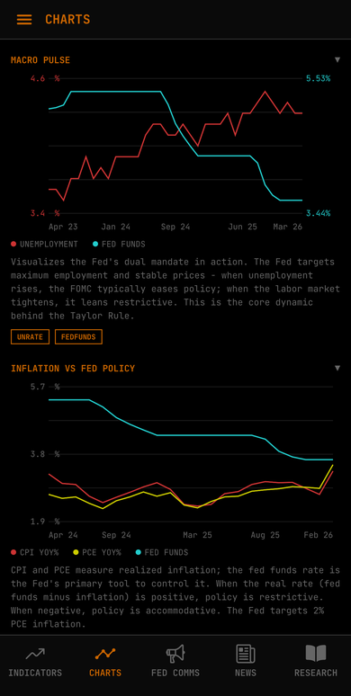
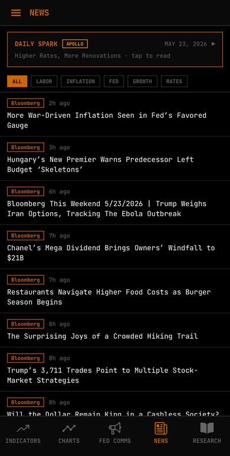
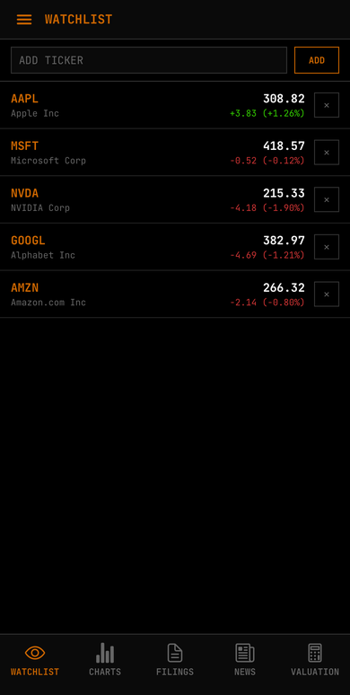
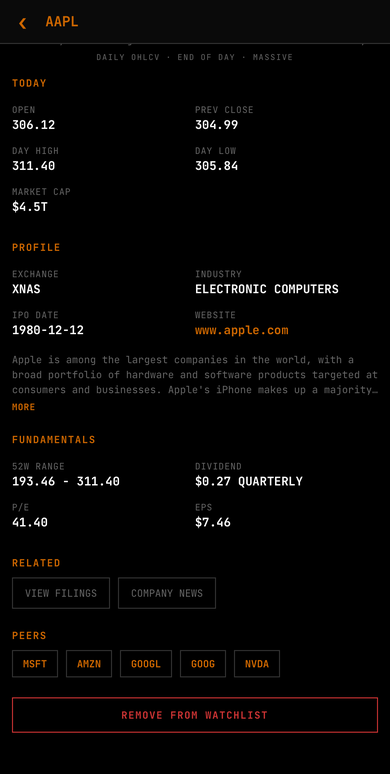
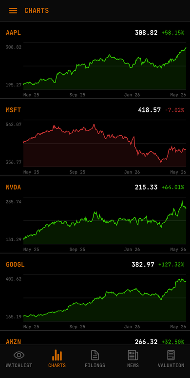
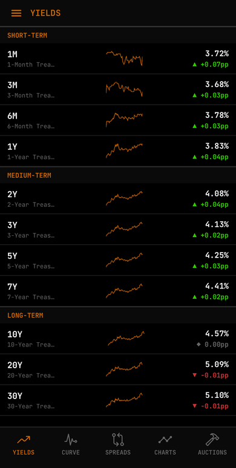
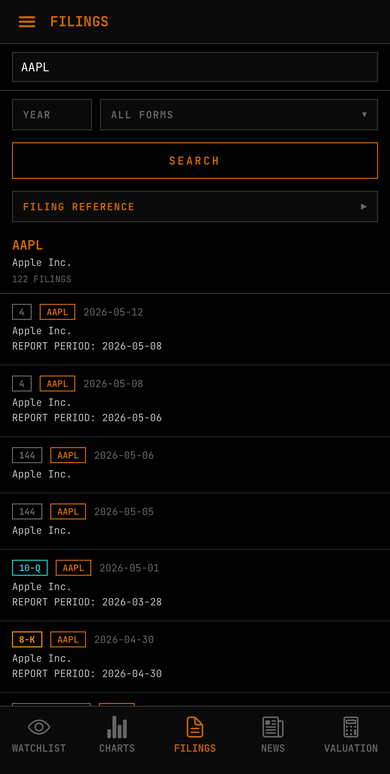
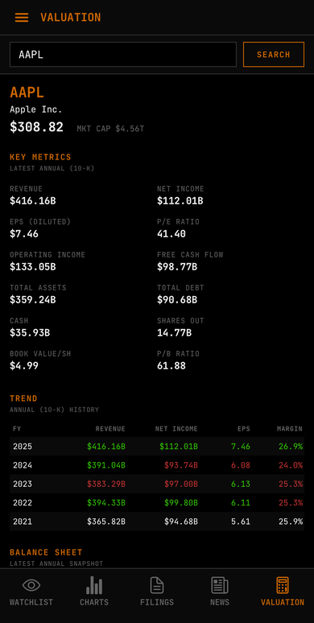

<p align="center">
  
</p>

<h1 align="center">Intrinsic Mobile</h1>

     

A mobile market intelligence app built with Expo and React Native. Dense, data-focused dark monospace interface for tracking U.S. macroeconomic indicators, equities, SEC filings, and Federal Reserve communications.

## Screenshots

| | | |
|---|---|---|
|  |  |  |
|  |  |  |
|  |  |  |

## Features

**Economy** - FRED and BLS macro series grouped by Labor, Inflation, Growth, and Interest Rates. Sparklines, historical analysis, multi-series overlay charts. AI-powered Macro Summary via Claude API with AsyncStorage caching by calendar date.

**Fed Comms** - Federal Reserve press releases, FOMC statements, meeting minutes, and speeches via RSS. Filter chips for FOMC, Minutes, Speeches, and Other.

**News** - Aggregated financial news with category filters (Labor, Inflation, Fed, Growth, Rates). Daily Spark briefing from Apollo Chief Economist with AI interpretation.

**Research** - FRED Blog posts and BLS reports with series tag badges. Filter by source type.

**Stocks** - Watchlist with live quotes and company profiles via Finnhub. Stock detail modal with price charts, fundamentals, and deep links to filings and company news.

**Filings** - SEC EDGAR search by ticker, year, and form type. Supports all filing years back to 1993 with automatic pagination of EDGAR submission archives. Collapsible filing type reference card.

**Company News** - Google News RSS feed driven by the watchlist. Filter by individual ticker or view all.

**Bonds, ETFs, Futures, Commodities** - Navigation and tab structures are defined and ready for implementation.

## Tech Stack

- Expo SDK 54, React Native, TypeScript
- Custom animated drawer navigation, material-top-tabs, native-stack
- JetBrains Mono font
- react-native-svg for charting
- fast-xml-parser for RSS/XML feeds
- Cloudflare Worker proxy for third-party API key management and Daily Spark delivery
- Claude API for AI commentary (Macro Summary, Daily Spark interpretation)

## Setup

### Prerequisites

- Node.js 18+
- Expo CLI (`npm install -g expo-cli`)
- Expo Go on a physical device or an emulator

### API Keys (all free tier)

- [FRED API](https://fred.stlouisfed.org/docs/api/api_key.html) - macroeconomic data
- [BLS API](https://data.bls.gov/registrationEngine/) - employment data
- [Anthropic API](https://console.anthropic.com/) - AI commentary (optional)
- A deployed Cloudflare Worker holding Finnhub and Alpha Vantage keys

### Install

```bash
git clone https://github.com/salvatore-ardisi/intrinsic-public.git
cd intrinsic-public
npm install
```

### Configure

Copy `.env.example` to `.env` and fill in your keys:

```bash
cp .env.example .env
```

```
FRED_API_KEY=your_key
BLS_API_KEY=your_key
ANTHROPIC_API_KEY=your_key
ENABLE_AI=false
EDGAR_USER_AGENT=YourApp you@example.com
PRICE_PROXY_URL=https://your-worker.workers.dev
```

### Run

```bash
npx expo start --clear
```

Scan the QR code with Expo Go on your device. Use `--tunnel` if your device is on a different network.

## Architecture

The app uses a floor-based navigation model. A custom animated drawer selects an asset class (Economy, Stocks, Bonds, etc.). Each floor is a material-top-tabs navigator with a bottom tab bar supporting swipe between tabs. The stock detail screen is a root-level native-stack modal to avoid gesture conflicts with the drawer and pager.

A Cloudflare Worker proxy holds third-party API keys server-side so the app bundle never ships them. It exposes quote, profile, news, candle, and spark endpoints with built-in response caching.

AI commentary (Macro Summary, Daily Spark interpretation) is generated via the Claude API and cached in AsyncStorage to avoid redundant API calls across sessions.

## Data Sources

| Source | Auth | Data |
|---|---|---|
| FRED API | Free API key | Macro indicators (unemployment, CPI, GDP, fed funds, treasuries, mortgage rates) |
| BLS API v2 | Free API key | Nonfarm payrolls, labor force participation |
| Federal Reserve | None | Press releases, FOMC statements, speeches (RSS) |
| SEC EDGAR | None (User-Agent required) | Company tickers, filings |
| Finnhub (via Worker) | Key in Worker | Stock quotes, company profiles |
| Alpha Vantage (via Worker) | Key in Worker | Daily price candles |
| Google News | None | Company news (RSS) |
| Apollo (via Worker) | Key in Worker | Daily Spark briefing |
| Claude API | API key | AI commentary and interpretation |

## License

This project is licensed under the GPL-3.0 License - see the [LICENSE](LICENSE) file for details.
